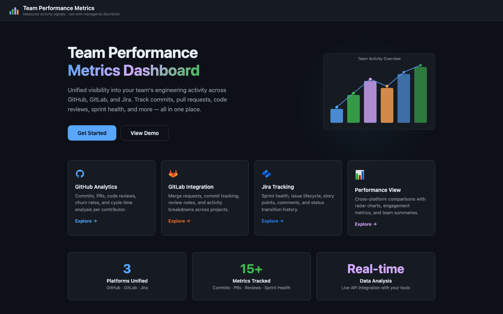
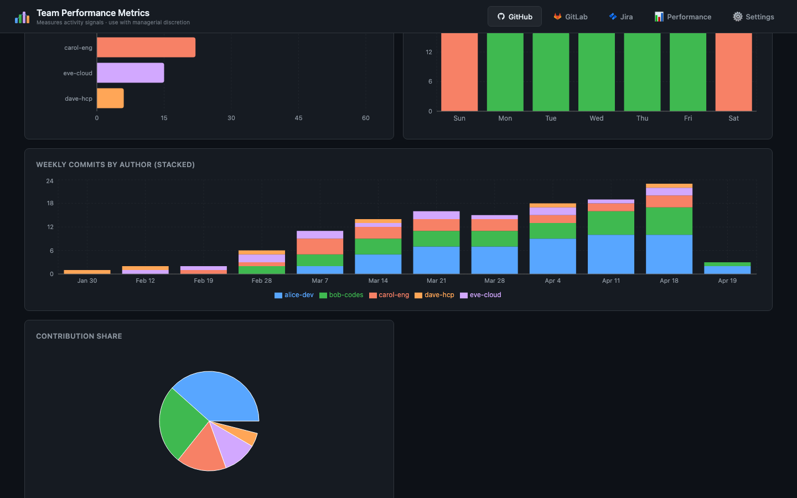
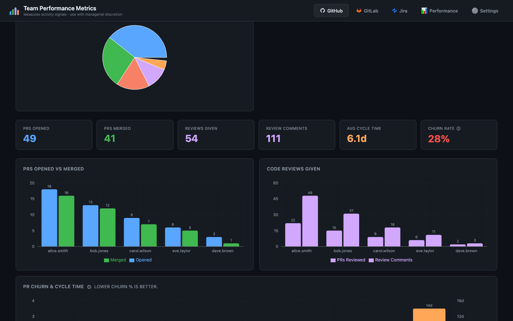
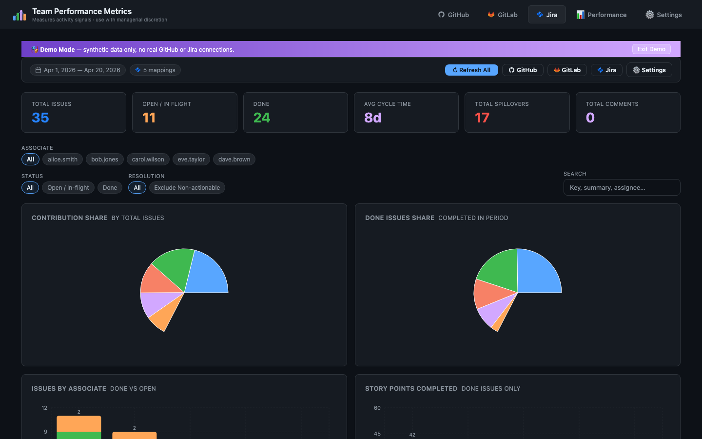
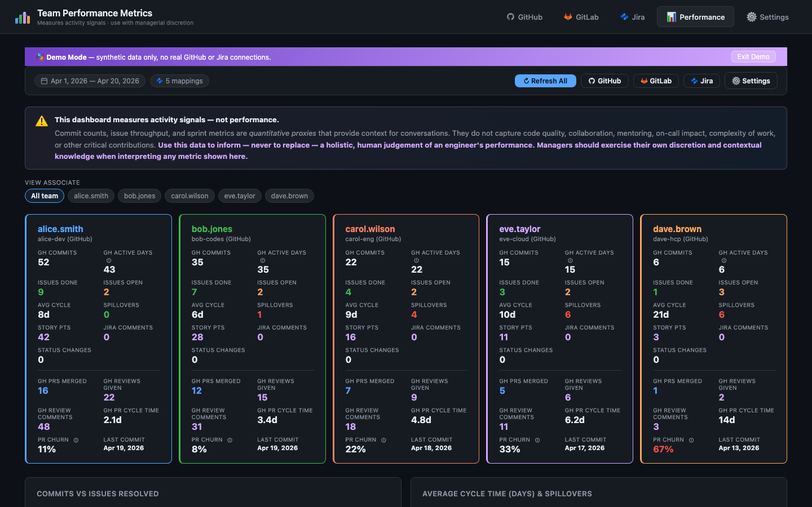
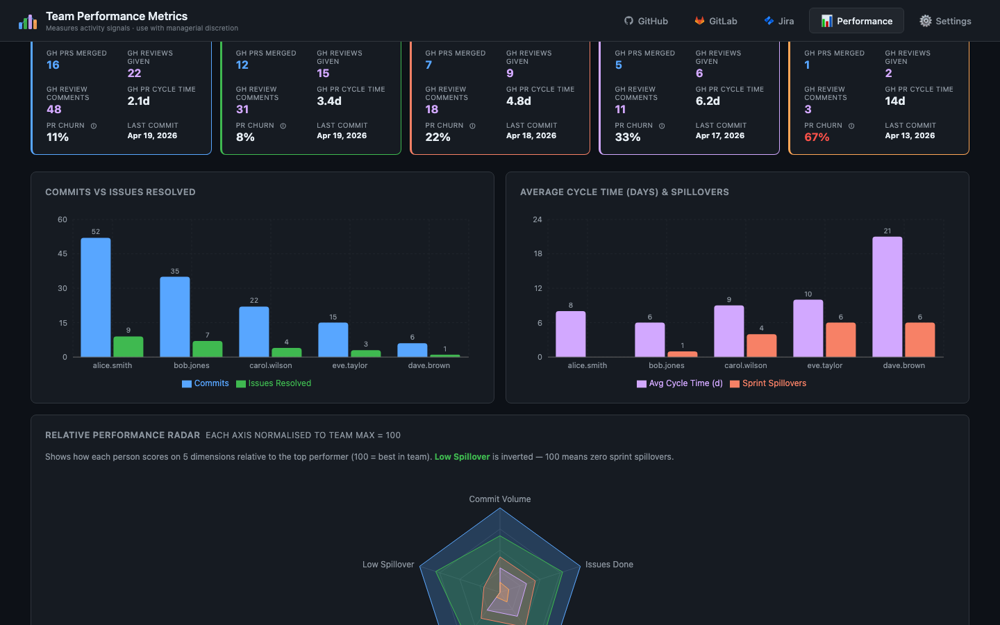
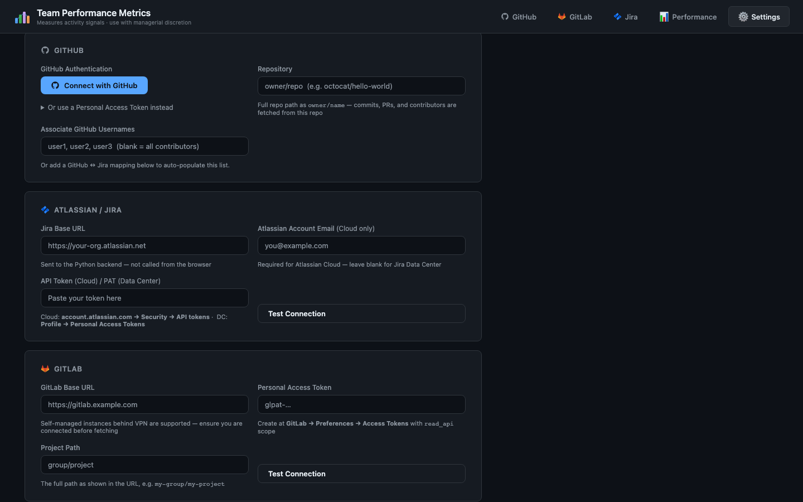

<p align="center">
  
</p>

<h1 align="center">Associate Performance Metrics</h1>

<p align="center">
  A full-stack engineering team performance dashboard that aggregates activity data from <strong>GitHub</strong>, <strong>GitLab</strong>, and <strong>Jira</strong> into a unified view for 1:1s and team reviews.
</p>

<p align="center">
  
  
  
  
  
</p>

---

## Features

- **GitHub Tab** — Commits, contributors, PR activity (opened / merged / reviewed), PR churn & cycle time charts, weekly commit breakdowns, and contribution share
- **GitLab Tab** — Merge requests, commit tracking, review notes, and activity breakdowns across projects
- **Jira Tab** — Issues, sprint spillovers, cycle time, story points, status transitions, per-associate filtering, and search
- **Performance Tab** — Unified metrics across all platforms, per-associate scorecards, relative radar chart, 1:1 associate deep-dive, and full summary table
- **Settings Tab** — GitHub OAuth / PAT, Jira Cloud & Data Center config, GitLab self-managed support, date range picker, GitHub-Jira username mapping, single "Fetch All" button
- **Demo Mode** — One-click synthetic data with a realistic performance spread for presentations and evaluation

---

## Screenshots

<details>
<summary><strong>GitHub Analytics</strong> — Commit activity, contribution share, weekly breakdowns</summary>
<br />

<br /><br />

</details>

<details>
<summary><strong>Jira Tracking</strong> — Issues, cycle time, story points, sprint health</summary>
<br />

</details>

<details>
<summary><strong>Performance View</strong> — Cross-platform scorecards, radar charts, team summaries</summary>
<br />

<br /><br />

</details>

<details>
<summary><strong>Settings</strong> — Integration config, OAuth, date range, username mapping</summary>
<br />

</details>

---

## Tech Stack

| Layer    | Technology                                         |
| -------- | -------------------------------------------------- |
| Frontend | React 19, Vite 7, Recharts, react-datepicker, Lucide icons |
| Backend  | Python 3.13, FastAPI, `jira` library, `requests`   |
| Auth     | GitHub OAuth (+ PAT fallback), Jira PAT / Basic Auth |
| Infra    | Docker, Docker Compose, Podman compatible          |

---

## Getting Started

### Option 1: Docker / Docker Compose (Recommended)

The fastest way to get up and running — no local Node.js or Python installation required.

**1. Configure environment variables**

```bash
cp backend/.env.example backend/.env
# Edit backend/.env with your credentials
```

**2. Start both services**

```bash
docker compose up --build
```

The app will be available at **http://localhost:5173** with the API on port 8000.

> **Using Podman?** Podman Desktop works as a drop-in replacement. If `podman compose` is not available, you can run the containers individually — see [Running with Podman](#running-with-podman) below.

**3. Stop the services**

```bash
docker compose down
```

#### Docker Architecture

```
┌──────────────────────┐     ┌──────────────────────┐
│   Frontend (Vite)    │────▶│   Backend (FastAPI)   │
│   Node 22 Alpine     │     │   Python 3.13 Slim    │
│   Port 5173          │     │   Port 8000           │
└──────────────────────┘     └──────────────────────┘
         │                              │
    Volume mounts               Volume mounts
    for hot reload              for live reload
```

Both containers use volume mounts so code changes are reflected immediately without rebuilding.

---

### Option 2: Local Development

#### 1. Frontend

```bash
npm install
npm run dev          # http://localhost:5173
```

#### 2. Backend

```bash
cd backend
pip install -r requirements.txt

# Copy and fill in credentials
cp .env.example .env

uvicorn main:app --reload --port 8000
```

---

### Running with Podman

If you use Podman Desktop without the compose plugin:

```bash
# Start the Podman machine (first time only)
podman machine start

# Build images
podman build -t apm-backend -f backend/Dockerfile backend/
podman build -t apm-frontend -f Dockerfile .

# Create a pod and run both containers
podman pod create --name apm-pod -p 5173:5173 -p 8000:8000

podman run -d --name apm-backend --pod apm-pod \
  --env-file backend/.env \
  -v ./backend:/app:Z \
  apm-backend

podman run -d --name apm-frontend --pod apm-pod \
  -e API_TARGET=http://localhost:8000 \
  -v ./src:/app/src:Z \
  -v ./public:/app/public:Z \
  -v ./index.html:/app/index.html:Z \
  -v ./vite.config.js:/app/vite.config.js:Z \
  apm-frontend
```

To stop and clean up:

```bash
podman pod stop apm-pod && podman pod rm apm-pod
```

---

## Configuration

### GitHub OAuth Setup

1. Go to [GitHub Developer Settings](https://github.com/settings/developers) and create a new OAuth App
2. Set the following values:
   - **Homepage URL**: `http://localhost:5173`
   - **Authorization callback URL**: `http://localhost:8000/api/github/callback`
3. Add the Client ID and Secret to `backend/.env`:

```env
GITHUB_CLIENT_ID=your_client_id
GITHUB_CLIENT_SECRET=your_client_secret
```

> **Note:** OAuth is optional. You can also use a [Personal Access Token](https://github.com/settings/tokens/new?scopes=public_repo&description=Team+Performance+Metrics) directly in the Settings tab.

### Environment Variables

| Variable              | Required | Default                    | Description                                      |
| --------------------- | -------- | -------------------------- | ------------------------------------------------ |
| `GITHUB_CLIENT_ID`    | No       | —                          | GitHub OAuth App client ID                       |
| `GITHUB_CLIENT_SECRET`| No       | —                          | GitHub OAuth App client secret                   |
| `GH_SCOPE`            | No       | `read:user,repo`           | GitHub OAuth scopes                              |
| `FRONTEND_ORIGIN`     | No       | `http://localhost:5173`    | Frontend URL for OAuth redirects                 |
| `GITLAB_SSL_VERIFY`   | No       | `false`                    | SSL verification for self-managed GitLab         |
| `API_TARGET`          | No       | `http://localhost:8000`    | Backend URL (used by Vite proxy in Docker)        |

### In-App Settings

All integration configuration is done through the **Settings** tab in the UI:

| Field             | Description                                                  |
| ----------------- | ------------------------------------------------------------ |
| GitHub token      | OAuth flow or manual PAT                                     |
| Repository        | `owner/repo` format (e.g., `octocat/hello-world`)           |
| Jira URL          | `https://your-org.atlassian.net` (Cloud) or Data Center URL |
| Jira API Token    | PAT (Data Center) or API token (Cloud)                       |
| Jira Email        | Only required for Jira Cloud (Basic Auth)                    |
| GitLab URL        | Self-managed instance URL                                    |
| GitLab Token      | Personal Access Token with `read_api` scope                  |
| Date range        | Calendar picker with quick presets                            |
| Username mapping  | GitHub login <-> Jira username/email mapping table            |

---

## Project Structure

```
associate-performance-metrics/
├── src/                    # React frontend source
│   ├── App.jsx             # Main application component
│   ├── App.css             # Styles
│   ├── github.js           # GitHub API integration
│   ├── gitlab.js           # GitLab API integration
│   ├── jira.js             # Jira API integration
│   └── demoData.js         # Demo mode synthetic data
├── backend/
│   ├── main.py             # FastAPI application
│   ├── requirements.txt    # Python dependencies
│   ├── .env.example        # Environment template
│   └── Dockerfile          # Backend container
├── Dockerfile              # Frontend container
├── docker-compose.yml      # Multi-service orchestration
├── vite.config.js          # Vite dev server + proxy config
├── package.json            # Node.js dependencies
└── docs/screenshots/       # Application screenshots
```

---

## Disclaimer

> This dashboard measures **activity signals**, not performance. Commit counts, issue throughput, and sprint metrics are quantitative proxies that provide context for conversations. They do not capture code quality, collaboration, mentoring, on-call impact, complexity of work, or other critical contributions. **Use this data to inform — never to replace — a holistic, human judgement of an engineer's performance.**
